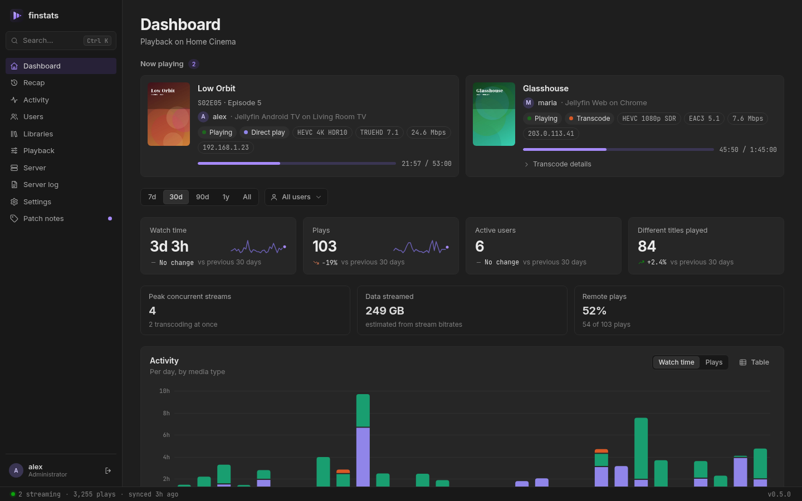
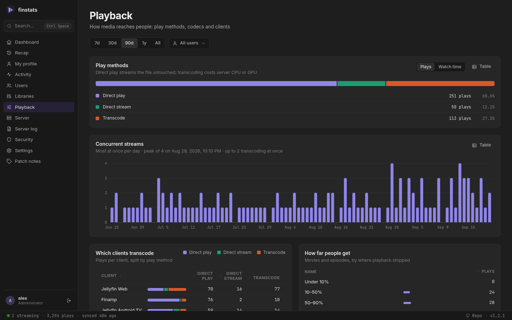
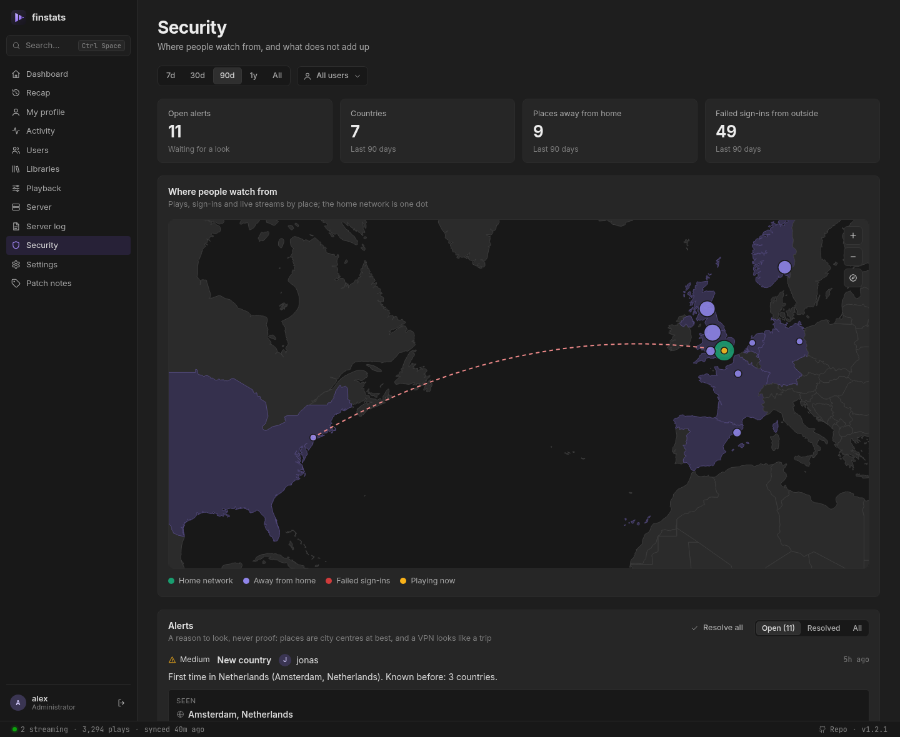
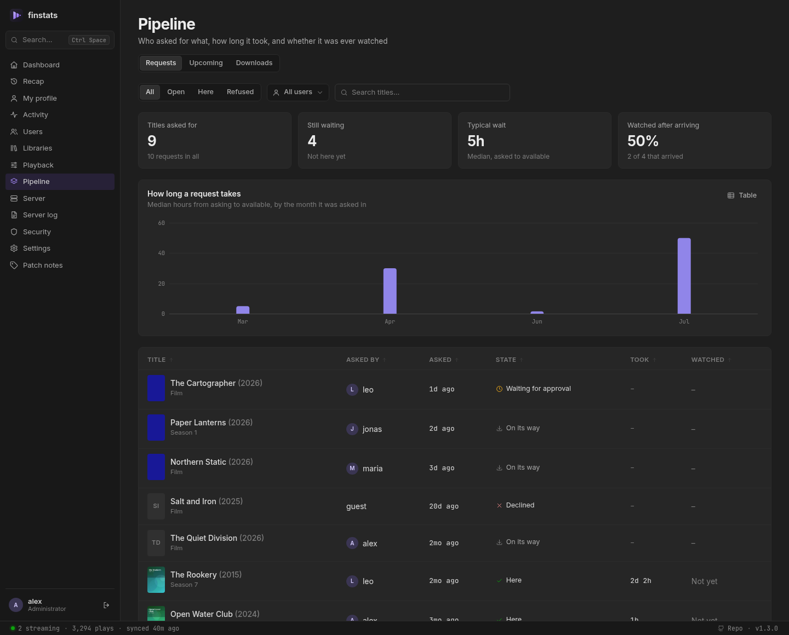
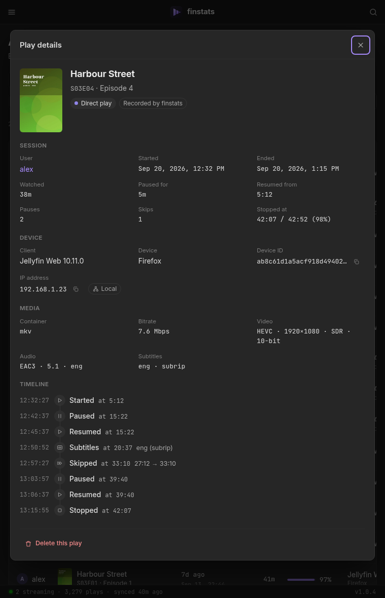
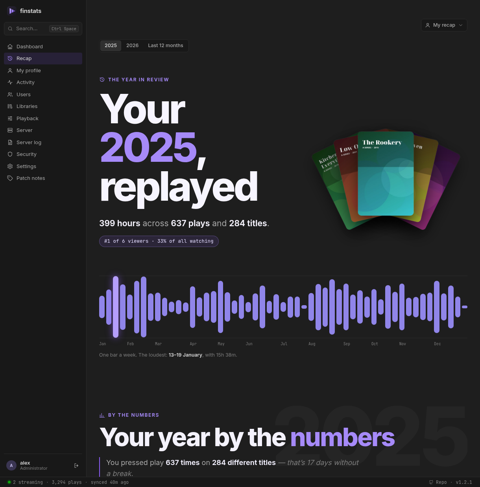

<p align="center"></p>
<h1 align="center">finstats</h1>

<p align="center">
  <b>See what your Jellyfin server is really doing.</b><br>
  Who is watching, what they watch, how it streams — and your year in review.<br>
  One tiny container. No database server. Set up in two minutes.
</p>

<p align="center">
  <a href="https://github.com/OlaYZen/finstats/releases/latest"></a>
  <a href="https://github.com/OlaYZen/finstats/pkgs/container/finstats"></a>
  <a href="https://github.com/OlaYZen/finstats/actions/workflows/docker.yml"></a>
  <a href="LICENSE"></a>
</p>

<p align="center">
  
</p>

## Why finstats

Jellyfin tells you what is playing right now. It does not tell you that one client transcodes
everything it touches, that four people stream at once every Saturday, or that a third of your
disk is films nobody has ever pressed play on.

finstats watches your server quietly in the background and turns that into answers. It is a
lightweight alternative to Jellystat and Streamystats: a single small program with its own
built-in database, using about **20 MB of memory**. Nothing else to install, nothing to maintain.

Already using Jellystat? [Bring your history with you](#moving-from-jellystat) — it takes seconds.

## What you get

### A live view of your server
See every stream as it happens: who, what, on which device and from where, whether it plays
directly or transcodes, and why. A status bar keeps the essentials in sight on every page.

### Answers, not just charts



- **How busy does it get?** Peak concurrent streams over time, and how many of them transcode.
- **Which apps cause transcoding?** Every client, split by direct play, remux and transcode, with the reasons Jellyfin reports.
- **How much leaves the house?** Local versus remote plays and an estimate of data streamed. finstats knows your
  household's public address, so a phone on the Wi-Fi that goes through your public name still counts as home.
- **Do people finish what they start?** See how far viewers get before they stop.
- **Want it in a different order?** Every table sorts by any column with a click, and long ones can be filtered as you type.
- **Is it dubbed?** Every title shows the languages of its audio and subtitle tracks. A show says how far a dub goes
  ("English: 13 of 26 episodes"), and each episode lists its own, so you know before you start.
- **What is my library made of?** Resolutions, codecs, HDR, size per decade, what was added when —
  and the big one: **titles nobody has ever watched**, sorted by how much space they take.

### Is that really them?



The **Security** page puts every play and sign-in on a world map: home is one dot, places away from
home another colour, streams running right now pulse, and failed sign-ins from outside show up in red.
When an account is somewhere it cannot be (home at eight, another continent twenty minutes later, or
two places at once), finstats raises an *impossible travel* alert with both sightings, the distance and
the speed it would have taken; the first time someone shows up in a new country is flagged too. Mark a
VPN or a holiday as fine and it stays quiet. Addresses are looked up in a database file on your own
machine and the map is drawn by finstats itself, so no address or coordinate is sent anywhere.

### What is coming in



finstats can also watch the rest of your setup, read-only: **Sonarr**, **Radarr** and **Seerr**, several of a kind if you
have them. Your download client needs no setup of its own — Sonarr and Radarr already talk to it, and finstats reads what
they know. The **Pipeline** page then answers the questions statistics alone cannot:

- **Was it worth getting?** Every request with who asked, how long it took to arrive, and whether they ever watched it —
  plus the list nobody likes to see: what arrived weeks ago and has never been played.
- **What is coming?** A calendar of new episodes and film releases, marked with who is actually watching that show, so a
  Friday episode of something three people follow stands out from one nobody has touched in a year.
- **What is arriving right now?** The live queue with progress, speed and what went wrong on import, plus what came in
  over the last week, month or year, by indexer, quality and download client.

Your own requests are yours to see; other people's need a permission, and the download queue another. API keys are stored
in finstats' own database, are never shown again, and are never part of a backup.

### Every play, down to the pause button



Other tools store one line per play. finstats records what happened *during* it: every pause and
resume, every skip, audio and subtitle switches, the moment a direct play turned into a transcode,
where playback picked up and where it stopped.

Alongside the usual details — device, app version, IP address and whether it was on your network,
video and audio format, bitrate, time watched versus time paused.

Every film and show lists its cast and crew, and every actor and director has a page of their own:
what they are in on your server, and how much of it has been watched.

Renamed a file? Jellyfin treats it as a new item and orphans its history. finstats notices and
re-attaches the old plays to the new entry.

### Who watches together
When two or more people press play on the same thing at the same time, finstats notices: which
groups watch together, what they watch, and how many hours they have spent doing it. It shows on
the dashboard, on each profile ("most often with"), and as a small mark on every shared play.

### Where you are in every show
Your profile shows each series as a bar with one segment per episode: seen, started, or not yet.
Only episodes that are actually on your server count, so an announced season does not spoil a
finished show. Watched something while nothing was recording? Jellyfin's own played marks fill the
gap, and you can mark episodes, seasons or whole shows as seen yourself. Alongside it: your longest
and current day streak.

<br clear="right">

### Your year in review



A personal recap for every user, in the spirit of Spotify Wrapped: hours watched, top shows, movies,
music and genres, the actors and directors you spent the most time with, and a viewing
personality — night owl, weekend warrior, binge watcher and more. See the whole year as a calendar
of days, find out which weekday took the crown, and collect the records worth bragging about:
biggest binge, longest daily streak, most rewatched title, the oldest film you watched.

Each person sees only their own. Administrators can open another person's recap; nobody else can,
whatever permissions they hold, and there is no recap of the whole server.

### Private by design
- **Sign in with your Jellyfin account.** No new passwords, and finstats never stores yours.
- **You decide who sees what.** Let family and friends sign in if you like. By default they get
  their own statistics and recap and nothing else. From there you grant more, per person or for
  everyone: other people's activity, network details like IP addresses, the server pages, or
  managing finstats itself. No permission opens other people's recaps.
- **Nothing about you leaves your network.** No telemetry, no accounts, no fonts or scripts loaded
  from the internet. Posters are fetched from your own Jellyfin. The one outside request finstats
  makes by default is a plain "what is my IP" lookup — asked **once**, so that people watching at home
  through your public address are not counted as remote, and after that never again unless you press the
  button. It carries no information about you or your server, and one switch in Settings turns it off.
  **Settings → Outbound connections** lists every destination finstats can reach and whether it is
  switched on, so the promise is one you can check rather than one you have to take. The Security map needs a geolocation database; downloading it is
  off until you ask for it, and addresses are always looked up on your own machine. Sonarr, Radarr, Seerr and torrent
  are reached at the addresses you enter, on your own network.
- **Read-only.** finstats never changes anything on your Jellyfin server and never starts a library scan. The same goes for
  the services you connect (Sonarr, Radarr, Seerr): it reads, and that is all.

## Get started

You need Docker and a Jellyfin server (10.9 or newer).

```sh
docker run -d --name finstats --restart unless-stopped \
  -p 8080:8080 \
  -e TZ=Europe/London \
  -v "$PWD/data:/data" \
  ghcr.io/olayzen/finstats:latest
```

<details>
<summary>Prefer Docker Compose?</summary>

```yaml
services:
  finstats:
    image: ghcr.io/olayzen/finstats:latest
    container_name: finstats
    restart: unless-stopped
    ports:
      - "8080:8080"
    environment:
      TZ: Europe/London   # your timezone
    volumes:
      - ./data:/data
```

</details>

The image is published for 64-bit Intel/AMD and ARM machines (a Raspberry Pi 4 or 5 works) at
[`ghcr.io/olayzen/finstats`](https://github.com/OlaYZen/finstats/pkgs/container/finstats). `:latest` is the newest release;
pin a version such as `:1.0.0`, or `:1` for every 1.x update, if you prefer to choose when to upgrade. `:edge` follows
development and may be rough.

Then open **http://your-server:8080** and:

1. Enter your Jellyfin address and test the connection.
2. Sign in with a Jellyfin administrator account.

That's it. finstats starts watching immediately and fills in your library in the background. The `data` folder is
created for you; finstats makes it its own and then runs as an ordinary, unprivileged user (1000:1000, or whatever
you set with `PUID` and `PGID`).
Set `TZ` to your own timezone so "today" and "evening" mean what you expect.

> Inside a container, `localhost` is the container itself. Use your server's address
> (for example `http://192.168.1.10:8096`) or the Jellyfin container's name.

## Moving from Jellystat

Your history comes with you. In Jellystat:

1. Open **Settings → Backup**
2. Select only **Activity** (it turns purple)
3. Under settings click **Settings**, scroll to the end and start a backup
4. Go back to **Backups**, open **Actions** on the new backup and click **Download**

In finstats, open **Settings → Import from Jellystat** and drop the file in.

Large backups are no problem — a 350 MB file imports in a few seconds — and importing the same
file twice is safe. One thing to know: Jellystat never recorded what happens during a play, so
imported history has no pause-and-skip timelines. Everything finstats records from now on does.
[How imported data is interpreted →](docs/jellystat-import.md)

## Settings

Everything works out of the box. If you want to tune it, **Settings** in the app has:

| | |
|---|---|
| **Access** | Who may sign in and what they may see, for everyone or per person: *sign in*, *see everyone's activity*, *see network details*, *see the server*, *manage finstats*. Jellyfin administrators always have everything, and only they can change this. |
| **Follow Jellyfin's library scan** | On by default. finstats refreshes its copy of your library right after Jellyfin's own scheduled scan — no second schedule to manage. |
| **Let Jellyfin push what is playing** | Off until you turn it on. finstats keeps one connection open and is told the moment a play starts, pauses or ends, instead of asking every second — thousands fewer requests a day, and nothing noticed late. It still checks with a plain request once a minute while something plays, and falls straight back to asking on a timer if the connection drops. |
| **Check every…** | How often finstats looks at what is playing when it is asking: every second while someone is watching, every 5 seconds while nobody is. Also the fallback for the setting above. |
| **Treat a restart as the same play** | A stream that stops and resumes within 10 minutes counts as one viewing. |
| **Home network** | Which plays count as local. Private addresses always do; with *Recognise my own public address* on (the default), so does your household's public IP, looked up **once** and remembered. *Look up now* asks again on the day it changes; you can also add addresses by hand. |
| **Connections** | Sonarr, Radarr and Seerr, several of a kind if you have them. Each is tested before it is saved; API keys are never shown again and never part of a backup. Jellyfin administrators only. |
| **Security** | The city database that places addresses: download DB-IP's free one with a click and keep it fresh monthly, or drop your own `.mmdb` into `data/geoip/`. Also how fast (900 km/h) and how far apart (500 km) two sightings must be to count as impossible travel. |
| **Count it as watching together within** | How close together different people must start the same title to count as a group. Default 60 seconds. |
| **Ignore plays shorter than** | Leave accidental clicks out of the statistics. |

<details>
<summary>Environment variables</summary>

| Variable | Default | |
|---|---|---|
| `TZ` | UTC | Your timezone, for per-day and hour-of-day statistics. |
| `FINSTATS_BIND` | `0.0.0.0:8080` | Address to listen on. |
| `FINSTATS_DATA_DIR` | `/data` | Where the database and poster cache live. |
| `PUID`, `PGID` | `1000` | The user and group finstats runs as inside the container, and that will own the `data` folder. Set them to the owner of your files if that is not 1000. (`--user` works too; the folder must then already be writable for that user.) |
| `FINSTATS_TRUST_PROXY` | off | Set to `1` behind a reverse proxy so sign-in rate limiting sees real client addresses. |
| `JELLYFIN_URL` + `JELLYFIN_API_KEY` | – | Skip the setup wizard. Set both or neither. |
| `FINSTATS_PUBLIC_IP_URL` | – | Your own "what is my IP" service (any URL answering with the caller's address as plain text), used instead of the built-in ones. |
| `FINSTATS_GEOIP_DB` | – | A city database (`.mmdb`, MaxMind format) to place addresses with, instead of the newest file in `data/geoip/`. |
| `RUST_LOG` | `finstats=info` | Log detail, e.g. `finstats=debug`. |

</details>

## Moving finstats to another machine

Download a backup under **Settings → Backups**, set up the new finstats, and restore the file on its
**Settings → Backups** page (or `finstats restore <file>`). Restoring merges, so nothing is lost if the new
instance has already been collecting. The library is read from Jellyfin again by itself.

## Updating

```sh
docker pull ghcr.io/olayzen/finstats:latest
docker rm -f finstats
# …then the same `docker run` as above. With Compose: docker compose pull && docker compose up -d
```

Your data lives in the `data` folder and upgrades itself on start-up; finstats also keeps its own weekly
backups there. After an update, the **Patch notes** tab shows a dot until you have read what changed. The same
notes are on the [releases page](https://github.com/OlaYZen/finstats/releases) and in [CHANGELOG.md](CHANGELOG.md).

Updates only go forward. The database remembers the newest version that has opened it, and an older finstats
refuses to start on it rather than risk your history; the message says how to get going again. To really go back to
an older version, start it on an empty data folder and restore one of the backups (`finstats restore <file>`).

## Questions

**Does it slow Jellyfin down?**
No. It asks Jellyfin one small question every few seconds and reads your library only after
Jellyfin has finished its own scan.

**Where is my data, and how do I back it up?**
finstats backs itself up every week into `data/backups` and keeps the newest five; download them under
**Settings → Backups**, where you can also restore one into a new install. A backup has your whole history,
settings and permissions, but never your Jellyfin API key. The database itself is the single file `data/finstats.db`.

**It says "cannot write to its data directory".**
The `data` folder belongs to a different user than the one finstats runs as. This happens when you start the
container with `--user` (or `user:` in Compose) on a folder Docker created as root. Either drop that setting, so
finstats can fix the folder itself, or run `sudo chown -R 1000:1000 ./data`.

**Can I put it behind a reverse proxy?**
Yes. Forward to port 8080 and set `FINSTATS_TRUST_PROXY=1`. Sign-in cookies are marked secure
automatically when the proxy reports HTTPS.

**How do I start over?**
Stop the container, delete the `data` folder, start it again. To clean up fully, also remove the
`finstats` API key in Jellyfin (Dashboard → API Keys).

**Is it safe to expose to the internet?**
It is built for it — Jellyfin-backed sign-in, rate limiting, hashed sessions, a strict content
security policy — but like anything self-hosted, a reverse proxy with HTTPS is strongly
recommended. [Security details →](docs/security.md)

## For developers

finstats is written in Rust with a dependency-free web UI compiled into the binary. The interface follows the
UX patterns collected at [uxgoodpatterns.com](https://uxgoodpatterns.com): forms that validate on submit, dialogs
that close three ways, tables you can sort, states for loading, empty and failed.

```sh
git clone https://github.com/OlaYZen/finstats.git && cd finstats
cargo build --release
FINSTATS_DATA_DIR=./data ./target/release/finstats
cargo test
docker build -t finstats:dev .          # your own image instead of the published one
```

Found a bug or have an idea? [Open an issue](https://github.com/OlaYZen/finstats/issues/new/choose); found a security
problem? [Report it privately](SECURITY.md). Questions go to
[Discussions](https://github.com/OlaYZen/finstats/discussions). Everyone taking part follows the
[code of conduct](CODE_OF_CONDUCT.md).

- [Contributing](CONTRIBUTING.md) — reporting bugs, what fits the project, running it from source or in a local Docker setup, the rules for a change, pull requests
- [HTTP API](docs/api.md) — the contract the web UI is built on
- [How Jellystat data is interpreted](docs/jellystat-import.md)
- [Security model](docs/security.md)
- [Patch notes](CHANGELOG.md)

The database holds your users, their IP addresses and your Jellyfin API key, and a Jellystat
backup is a complete viewing history. Both are ignored by git. Before contributing, switch on the
bundled commit guard as a second lock:

```sh
git config core.hooksPath .githooks
```

## License

finstats is free software under the [GNU General Public License v3.0](LICENSE). You may use,
study, share and change it; if you distribute a modified version, it has to stay under the same
license with its source available. It comes with no warranty.

The bundled fonts, Inter and JetBrains Mono, are under the SIL Open Font License 1.1
([Inter](web/assets/fonts/LICENSE-Inter.txt), [JetBrains Mono](web/assets/fonts/LICENSE-JetBrainsMono.txt)).

<sub>Screenshots show generated demo data: invented users, titles and artwork.</sub>
